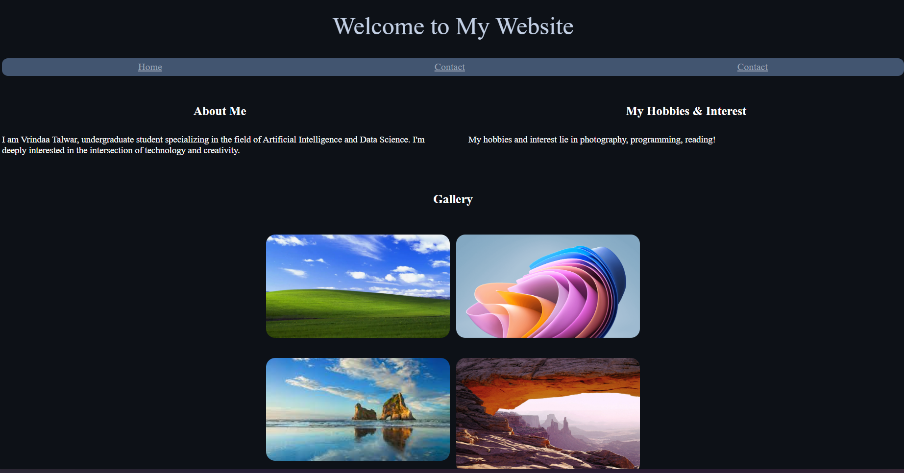

## Use of Flex and Grid 

This project is a basic HTML and CSS portfolio webpage built using **Flexbox** and **CSS Grid**. It features a clean layout with sections for personal information, hobbies, and a simple image gallery.

## Preview
## 📸 Preview



## Features

- Responsive layout using **Flexbox** (for text sections)
- Photo gallery built with **CSS Grid**
- Custom hover effects on images
- Simple navigation bar with custom link styling

## Files Included

- `index.html` – Main structure of the page
- `style.css` – Contains all the styling for layout, hover effects, and typography
- `README.md` – This file
- `assets` – Preview image file

## How to Run

1. Clone the repository:
   ```bash
   git clone git@github.com:your-username/your-repo-name.git
